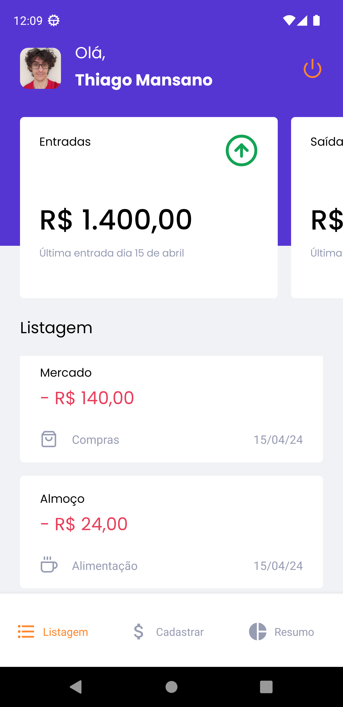
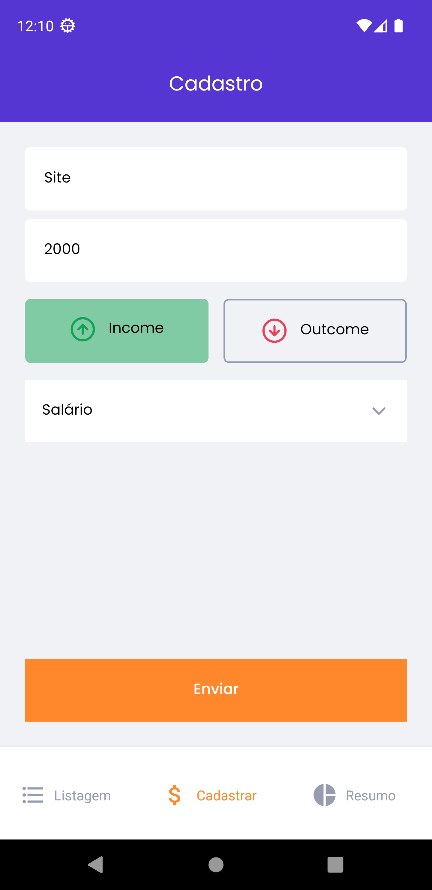
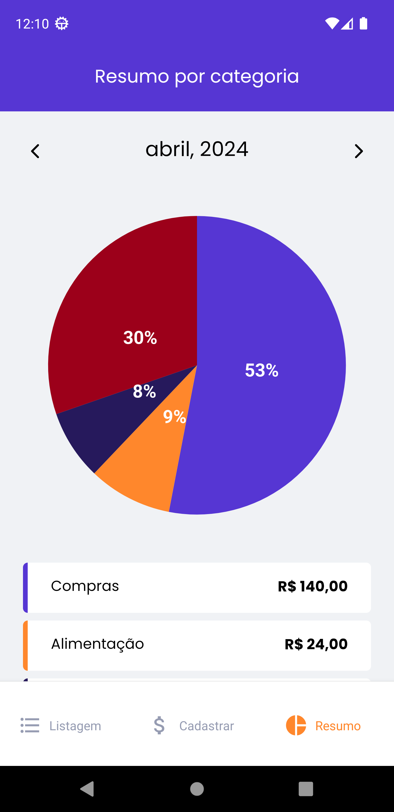
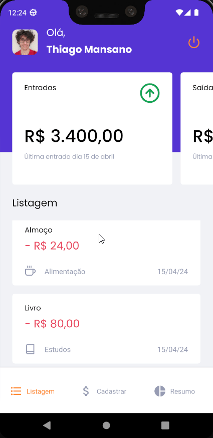

# Gofinance

## Sobre

Aplicativo elaborado junto ao curso do Ignite da Rockeatseat.

O objetivo do aplicativo é proporcionar ao usuário o controle de suas despesas para monitorar entradas e saídas oferecendo uma interface amigável.

## Aplicação

### Login

Logo após de instalar a aplicação o usuário é direcionado para a tela de login:

### Dashboard

Após o login o usuário será direcionado para a tela do dashboard onde haverá as suas transações e o resumo dessas:

### Cadastro de transação

Na tela de cadastro de transação, existem campos principais para registrar a transação e mapeá-la corretamente de acordo com o tipo e a categoria:

### Resumo

Aqui o usuário encontra todos os tipos de transações efetuadas separadas por categorias e filtradas mensalmente:

### App

## Installation

Dependência: Node: 18.17.0

Para configurar as variáveis do projeto crie um arquivo `.env` na raíz do diretório do projeto com as variáveis `IOS_CLIENT_ID` e `WEB_CLIENT_ID` assim como mostra no arquivo `.env-template`. Os valores poderão ser gerados no https://console.cloud.google.com que serão utilizados para a funcionalidade de login do aplicativo.

Para iniciar a aplicação basta rodar os comandos `npm install` e logo depois `npm run android` ou `npm run ios` caso esteja usando IOS.

## Tecnologias

## License

[MIT](https://choosealicense.com/licenses/mit/)
